# Formulae

## Collision Response

### Conservation of Momentum

  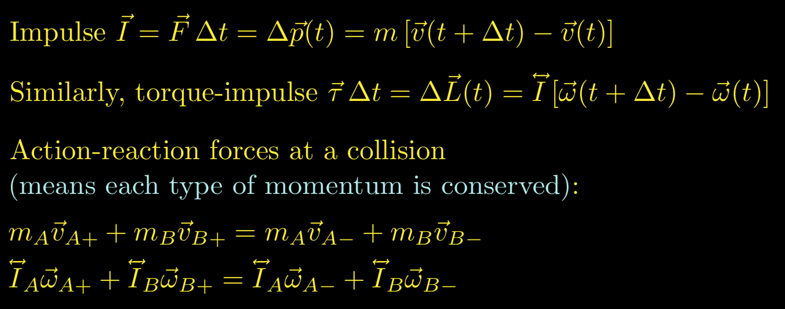

### Coefficient of Restitution

  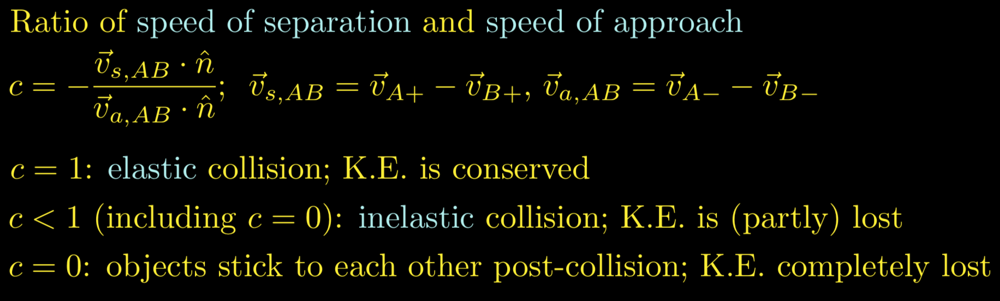

### Moment of Inertia

  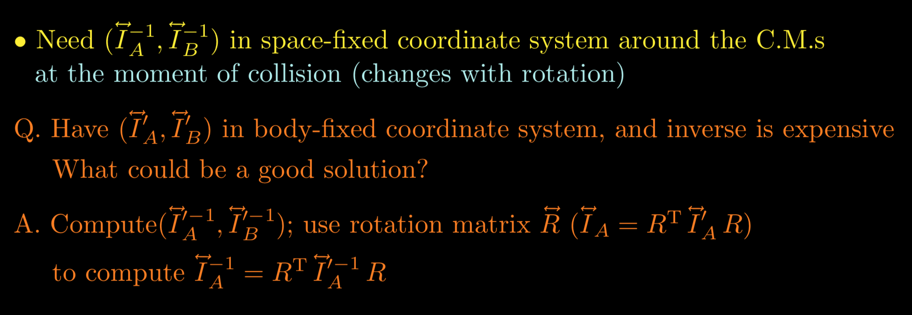

### Impulse without Friction

  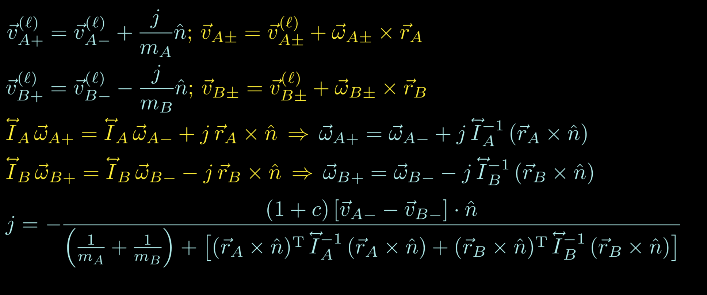

### Impulse with Friction

  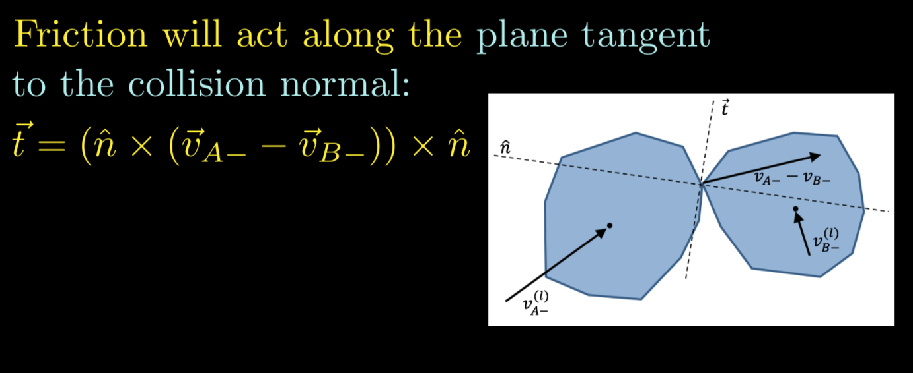

  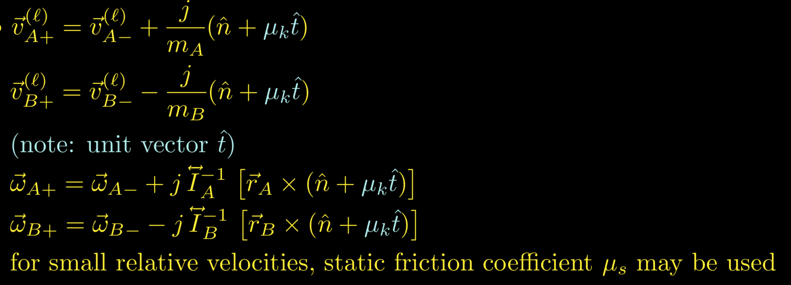

## Rigid Body Rotation

### Position

  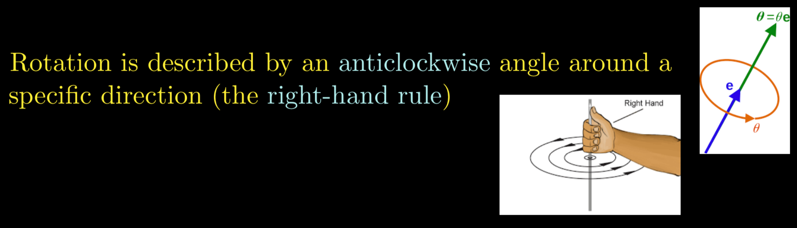

  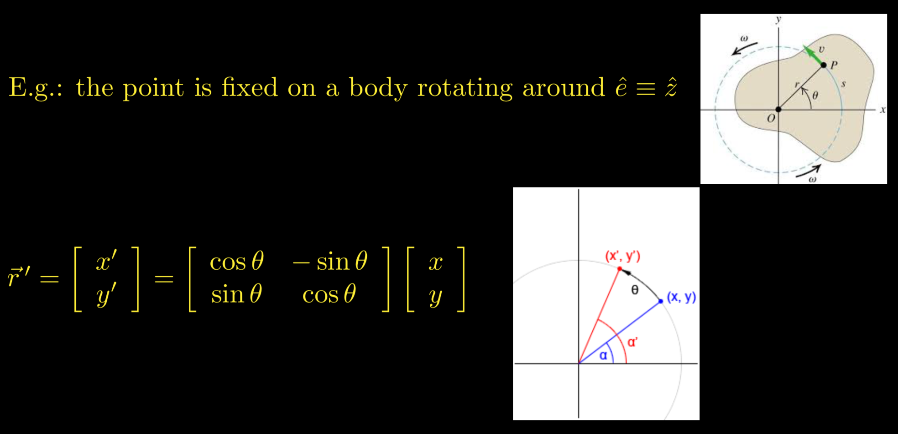

  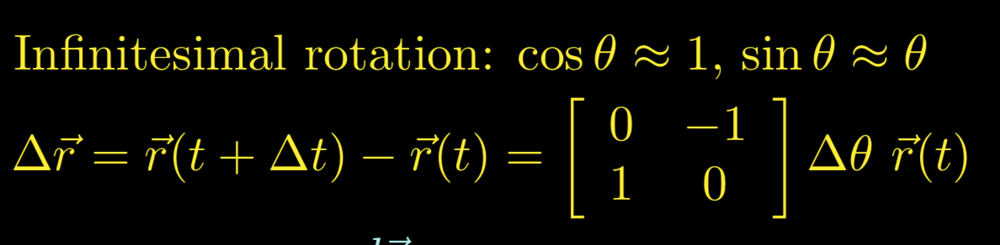

### Velocity

  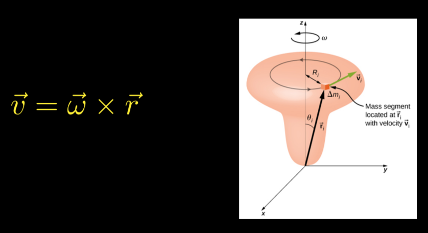

### Momentum

  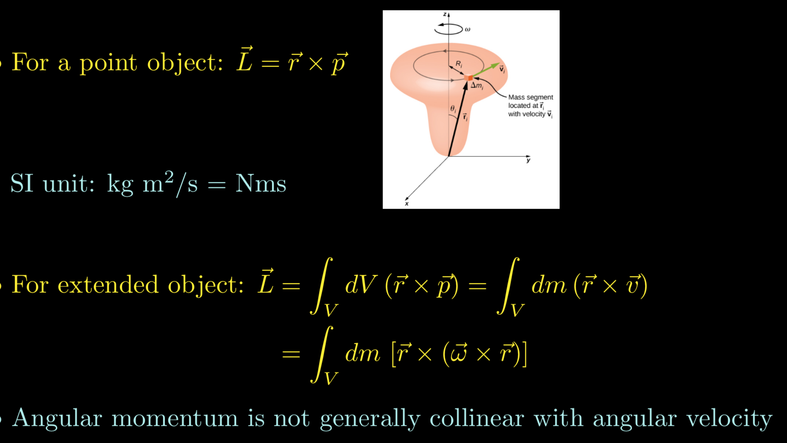

### Moment of Inertia

  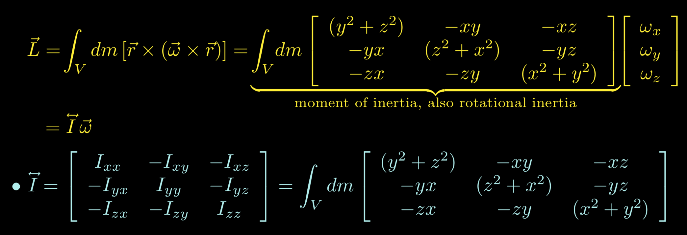

### Torque and Torque Impulse

  

### Translation as a Matrix operation

  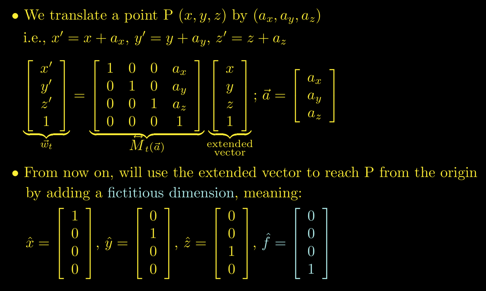

### Rotation as a Matrix operation

  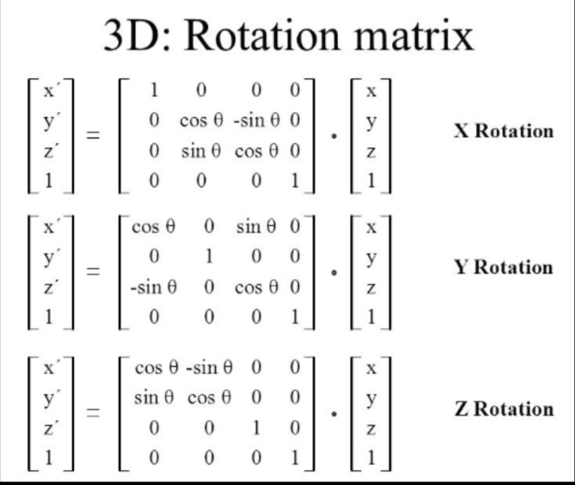

### Quaternion

### Analog

  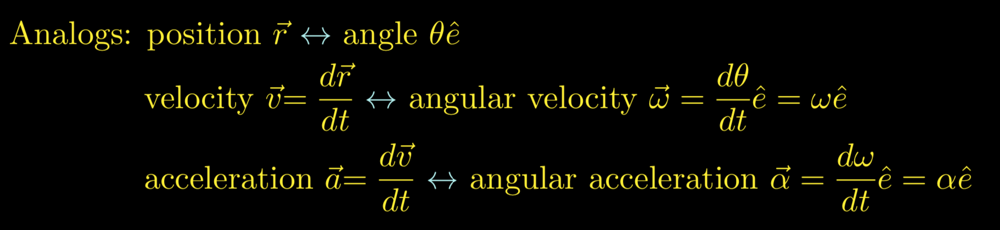

  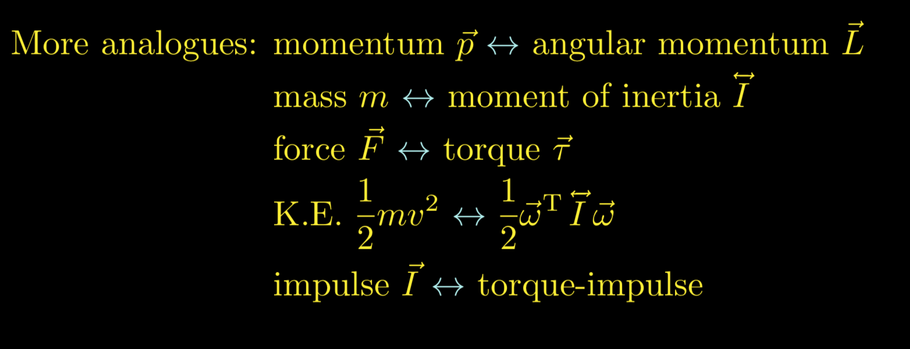

## Rigid Body Motion

  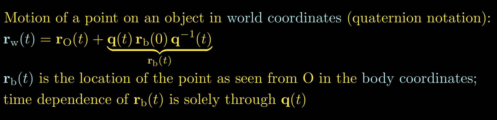

  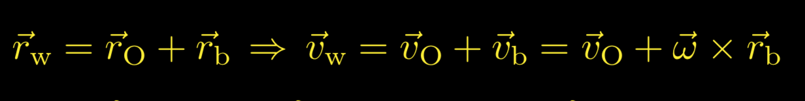

## Chain Rule

  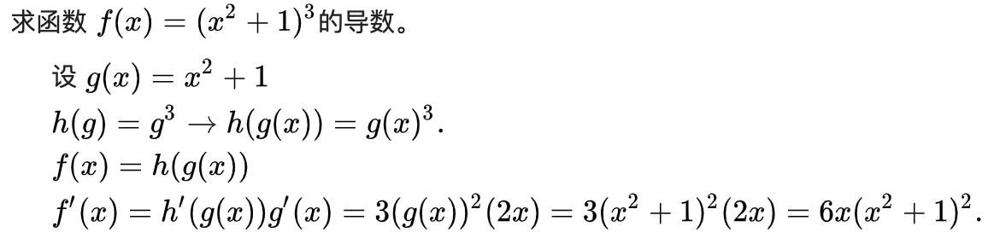

## References
* https://en.wikipedia.org/wiki/Chain_rule

