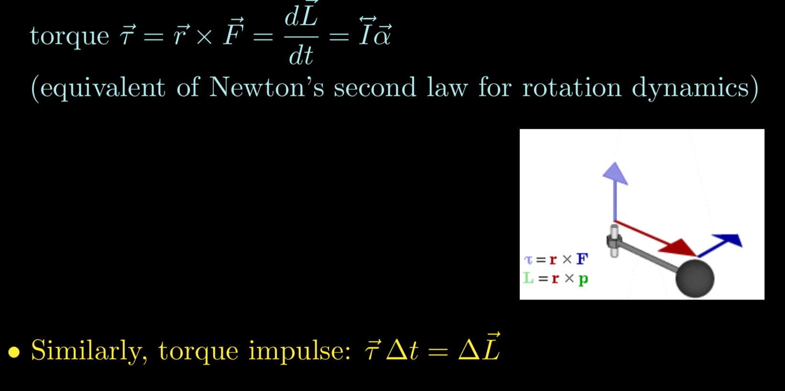
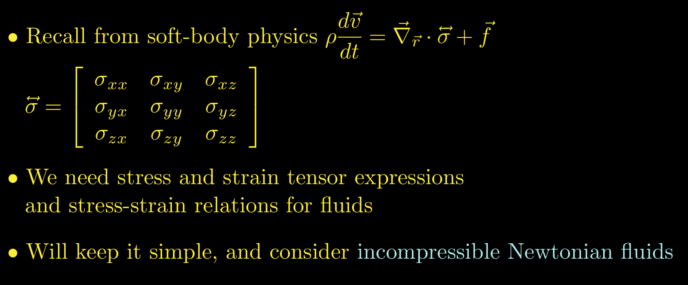
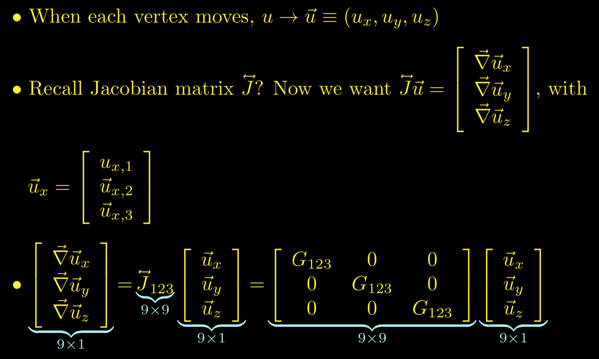

# Formulae

## Kinematic Equations based on Constant Acceleration
* v2 = v1 + at
* v22 = v12 + 2a(s2 - s1)
* s2 = s1 + v1t + (at2)/2

## Cross Product & Dot Product
* u . (v x w) = v . (w x u) = w . (u x v)
* u x (v x w) = (u . w)v - (u . v)w 

## Translation as a Matrix Operation

  

## Rotation as a Matrix Operation

  
  

## Definiteness of a Matrix

  

## Scalar Field

  

## Vector Field

  

## Angular Velocity - Rigid Body

  

* c = r Ω
* dc/dt = r dΩ/dt
* v = r w (direction of angular velocity w is determined by **right hand rule**) -> <mark>**v** = **w** x **r**</mark>
* dv/dt = r dw/dt
* at = r α (at is tangential acceleration) -> <mark>**at** = **α** x **r**</mark>
* an = v2/r = r w2 (an is centripetal acceleration) -> <mark>**an** = **w** x (**w** x **r**)</mark>

  

  

* **vR** = **vcg** + **vt** -> **vR** = **vcg** + (**w** x **r**)

  

* **aR** = **acg** + **an** + **at** -> **aR** = **acg** + (**w** x (**w** x **r**)) + (**α** x **r**)

  

## Quaternions

  

## Quaternions to describe Rotation

  

## Analogs

  

## Moment of Inertia = Rotational Inertia

  

  

  

## Parallel Axis Theorem

  

  

## Torque

  

## Forces on Free Rigid Bodies

  

## Work done by Forces on Rigid Bodies

  

## Collision Response

### Conservation of Momentum

  

### Coefficient of Restitution

  

### Moment of Inertia

  

### Impulse without Friction

  

### Impulse with Friction

  

  

## Rigid Body Rotation

### Position

  

  

  

### Velocity

  

### Momentum

  

### Moment of Inertia

  

### Torque and Torque Impulse

  

### Analog

  

  

## Rigid Body Motion

  

  

## Chain Rule

  

## Constraint Resolution

### Velocity Constraint

  

  

### Acceleration Constraint

  

### Constraint Force

  

### Sequential Impulse

  

### Generalized Holonomic Constraint

  

### Collision Resolution as Constraint Resolution

  

  

## Position-based Dynamics

  

### Equality Constraint

  

  

### Inequality Constraint

  

## Soft Body

### Local Deformation

  

### Deformation Tensor

  

  

  

### Infinitesimal Strain Tensor

  

### Poisson's Ratio

  

### Stress Tensor

  

### Elastic Moduli

  

### Elastic Energy

  

### Dynamics of Elastic Material

  

## Fluid Physics

### Velocity Field vs. Density Field

  

### Eulerian Description vs. Lagrangian Description

  

### Incompressibility -> Mass Conservation Equation

  

### Continuity Equation

  

## Fluid Dynamics

### Soft Body Physics

  

### Incompressible Newtonian Fluid: Stress Tensor

  

### Incompressible Newtonian Fluid: Stress-Strain Relations

  

  

### Euler Equation

  

## Finite Element Method (FEM)

### Eulerian (Space-fixed Meshes): Finite Difference Example

  

  

### Lagrangian (Body-fixed Meshes): FEM Basis

  

  

### Lagrangian (Body-fixed Meshes): Gradient

  

  

### Lagrangian (Body-fixed Meshes): Linear Elasticity in FEM

  

## Tetrahedral Meshes

  

### Linear Elasticity

  

  

### Stress-Strain Relations

  

  

  

### Elastic Energy

  

### Elastic Force

  

## Soft Body Dynamics

### Hooke's Law

  

  

### Deformation d and Displacement p

  

  

  

  

### Strain

  

  

  

## References
* https://en.wikipedia.org/wiki/Trigonometric_functions
* https://en.wikipedia.org/wiki/Right-hand_rule
* https://en.wikipedia.org/wiki/Cross_product
* https://en.wikipedia.org/wiki/Partial_derivative
* https://en.wikipedia.org/wiki/Total_derivative
* https://en.wikipedia.org/wiki/Scalar_field
* https://en.wikipedia.org/wiki/Vector_field
* https://en.wikipedia.org/wiki/Mechanical_energy
* http://www.chrishecker.com/Rigid_Body_Dynamics
* https://en.wikipedia.org/wiki/Chain_rule
* https://en.wikipedia.org/wiki/Finite_element_method
* https://en.wikipedia.org/wiki/Soft-body_dynamics
* http://graphics.cs.cmu.edu/courses/15-869/
* https://en.wikipedia.org/wiki/Sparse_matrix
