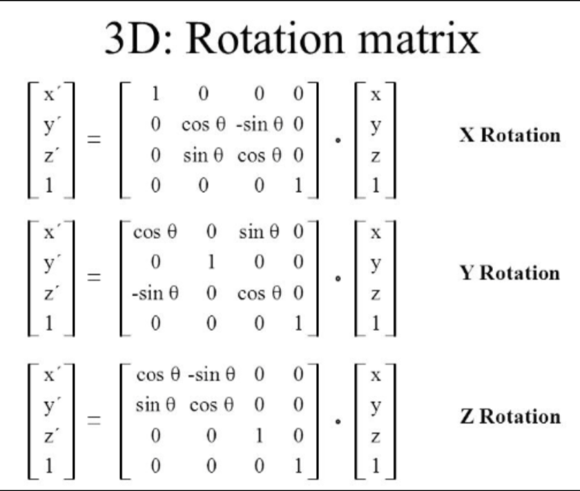
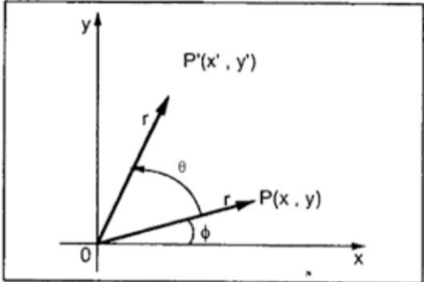
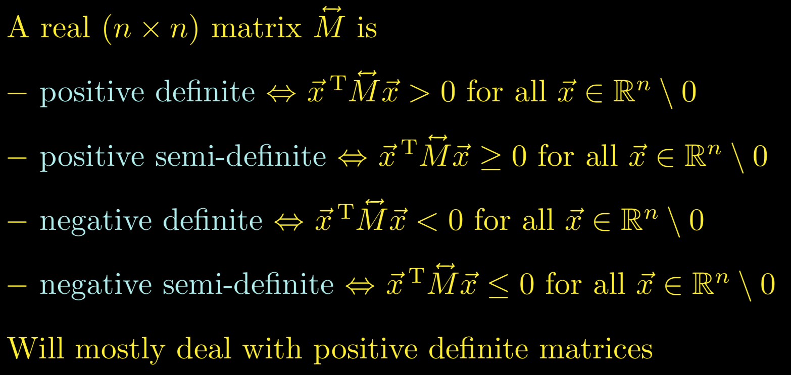
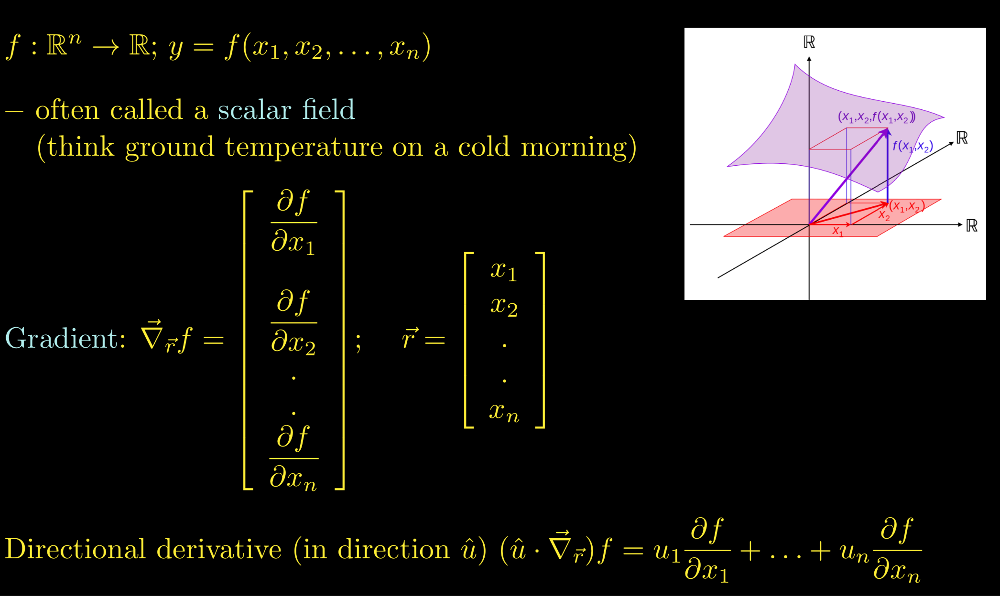
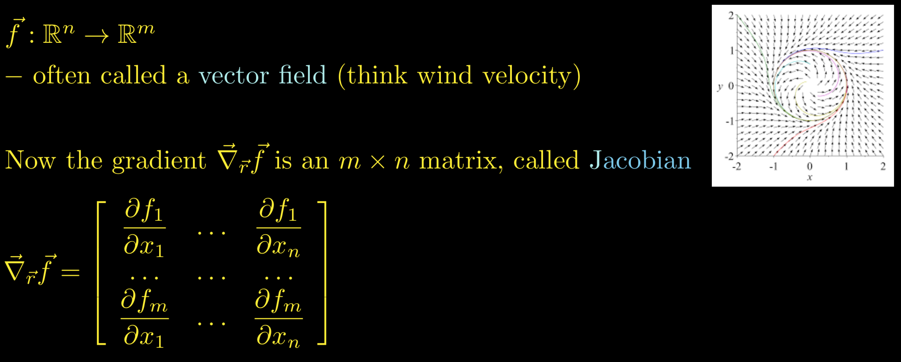
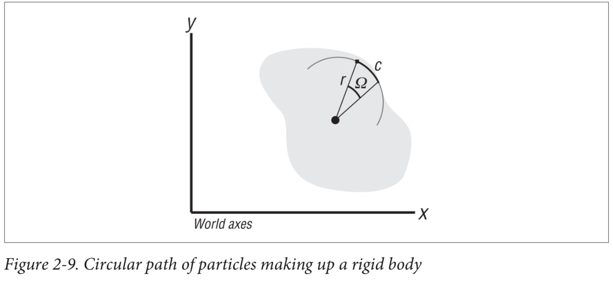
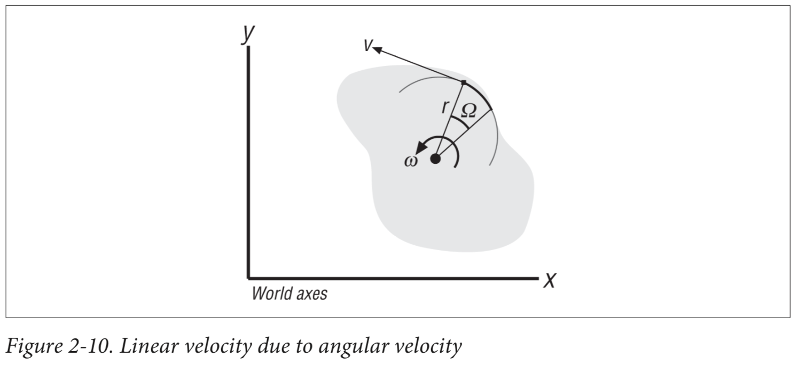
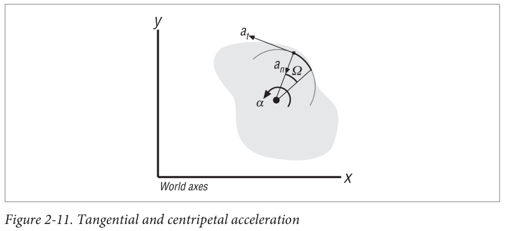

# Fundamentals

## Kinematic Equations based on Constant Acceleration
* v2 = v1 + at
* v22 = v12 + 2a(s2 - s1)
* s2 = s1 + v1t + (at2)/2

## Cross Product & Dot Product
* u . (v x w) = v . (w x u) = w . (u x v)
* u x (v x w) = (u . w)v - (u . v)w 

## Translation as a Matrix Operation

  

## Rotation as a Matrix Operation

  
  

## Definiteness of a Matrix

  

## Scalar Field

  

## Vector Field

  

## Angular Velocity - Rigid Body

  

* c = r Ω
* dc/dt = r dΩ/dt
* v = r w (direction of angular velocity w is determined by **right hand rule**) -> **v** = **w** x **r**
* dv/dt = r dw/dt
* at = r α (at is tangential acceleration) -> **at** = **α** x **r**
* an = v2/r = r w2 (an is centripetal acceleration) -> **an** = **w** x (**w** x **r**)

  

  

## References
* https://en.wikipedia.org/wiki/Trigonometric_functions
* https://en.wikipedia.org/wiki/Right-hand_rule
* https://en.wikipedia.org/wiki/Cross_product
* https://en.wikipedia.org/wiki/Partial_derivative
* https://en.wikipedia.org/wiki/Total_derivative
* https://en.wikipedia.org/wiki/Scalar_field
* https://en.wikipedia.org/wiki/Vector_field
* https://en.wikipedia.org/wiki/Mechanical_energy
