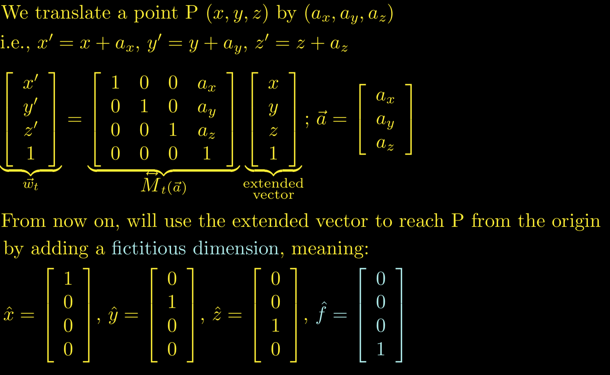
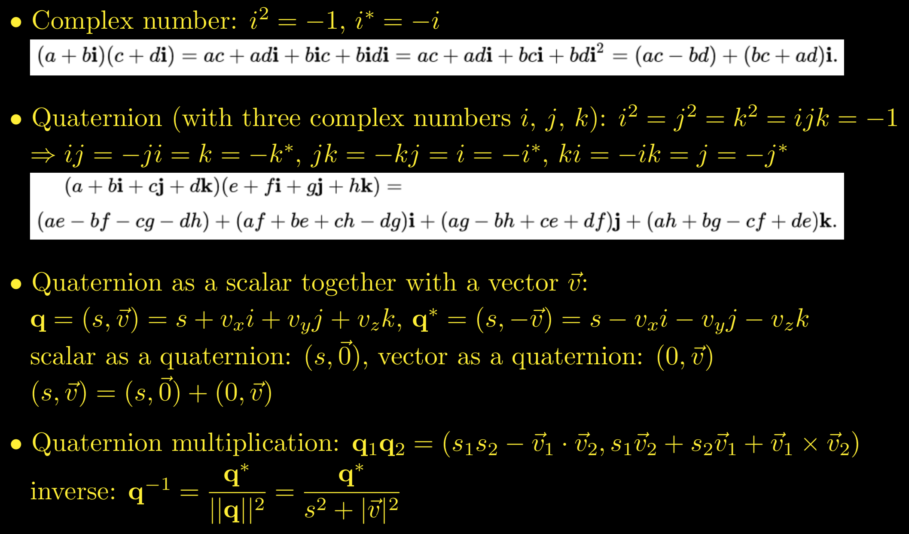
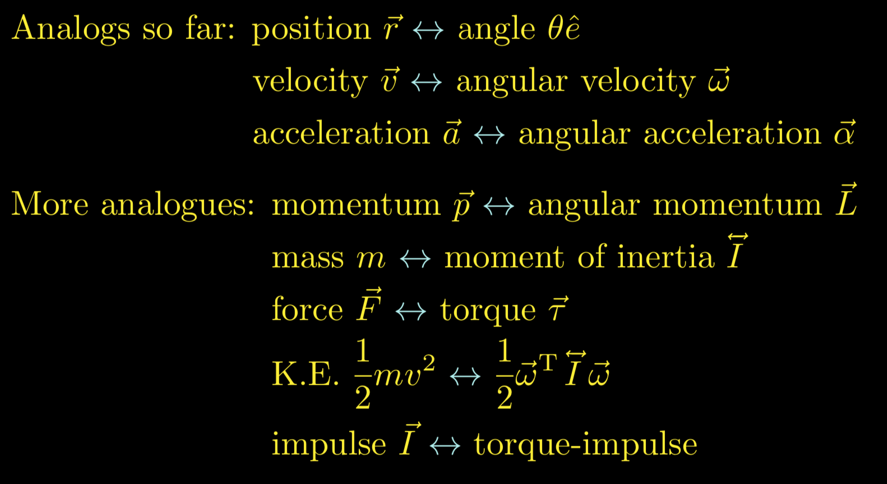
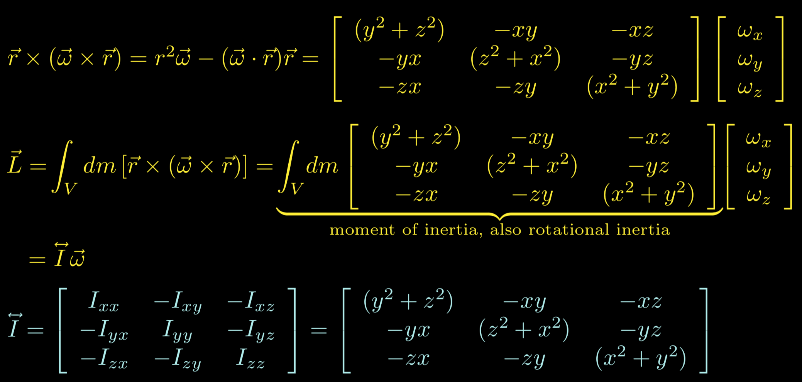
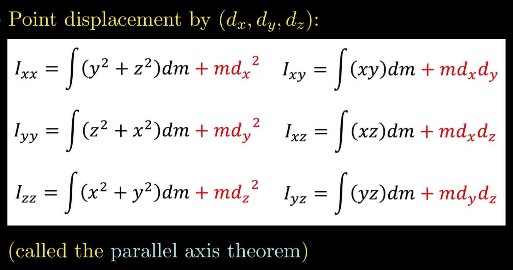
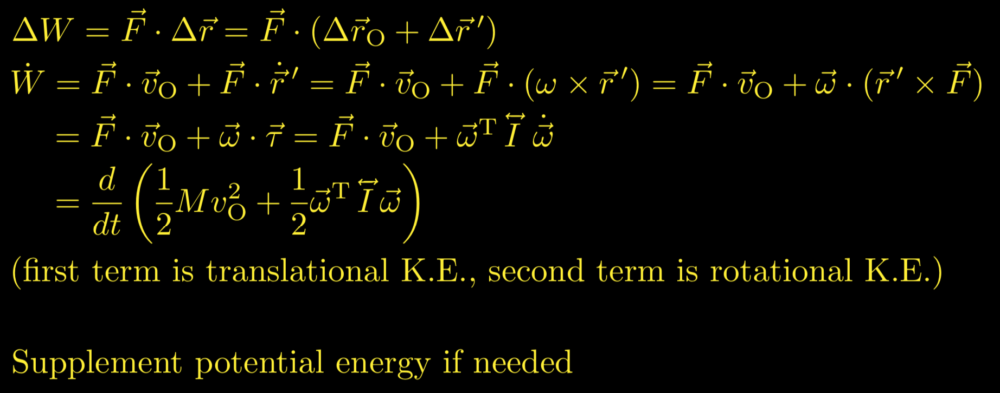

# Fundamentals

## Kinematic Equations based on Constant Acceleration
* v2 = v1 + at
* v22 = v12 + 2a(s2 - s1)
* s2 = s1 + v1t + (at2)/2

## Cross Product & Dot Product
* u . (v x w) = v . (w x u) = w . (u x v)
* u x (v x w) = (u . w)v - (u . v)w 

## Translation as a Matrix Operation

  

## Rotation as a Matrix Operation

  
  

## Definiteness of a Matrix

  

## Scalar Field

  

## Vector Field

  

## Angular Velocity - Rigid Body

  

* c = r Ω
* dc/dt = r dΩ/dt
* v = r w (direction of angular velocity w is determined by **right hand rule**) -> <mark>**v** = **w** x **r**</mark>
* dv/dt = r dw/dt
* at = r α (at is tangential acceleration) -> <mark>**at** = **α** x **r**</mark>
* an = v2/r = r w2 (an is centripetal acceleration) -> <mark>**an** = **w** x (**w** x **r**)</mark>

  

  

* **vR** = **vcg** + **vt** -> **vR** = **vcg** + (**w** x **r**)

  

* **aR** = **acg** + **an** + **at** -> **aR** = **acg** + (**w** x (**w** x **r**)) + (**α** x **r**)

  

## Quaternions

  

## Quaternions to describe Rotation

  

## Analogs

  

## Moment of Inertia = Rotational Inertia

  

  

  

## Parallel Axis Theorem

  

  

## Torque

  

## Forces on Free Rigid Bodies

  

## Work done by Forces on Rigid Bodies

  

## References
* https://en.wikipedia.org/wiki/Trigonometric_functions
* https://en.wikipedia.org/wiki/Right-hand_rule
* https://en.wikipedia.org/wiki/Cross_product
* https://en.wikipedia.org/wiki/Partial_derivative
* https://en.wikipedia.org/wiki/Total_derivative
* https://en.wikipedia.org/wiki/Scalar_field
* https://en.wikipedia.org/wiki/Vector_field
* https://en.wikipedia.org/wiki/Mechanical_energy
* http://www.chrishecker.com/Rigid_Body_Dynamics
